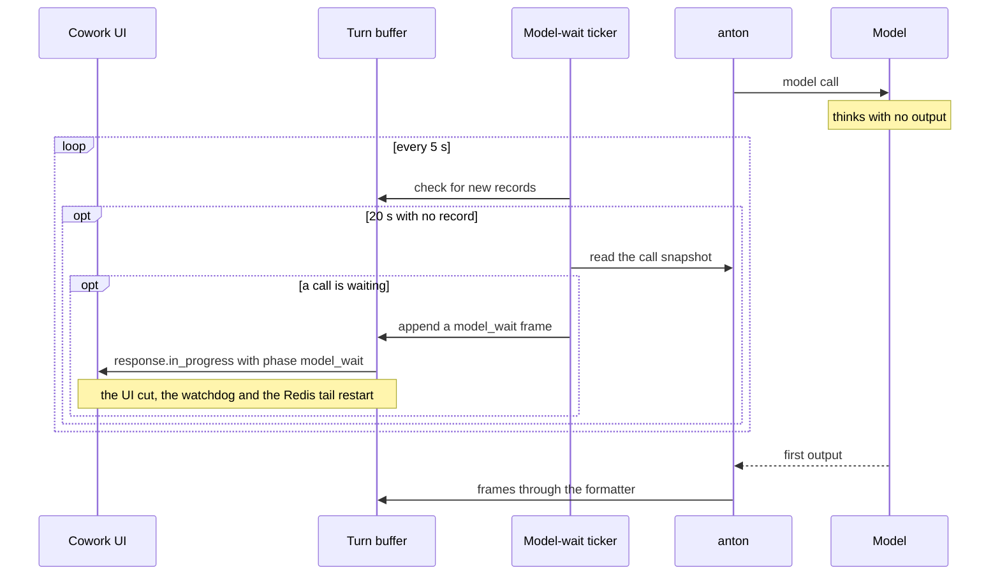

# Cowork Server API — Design Notes

## Architectural Overview

> Note (2026-09-10, ENG-2608): the Hermes harness described below was removed; Anton is the only shipped harness. Kept as historical rationale for the harness abstraction.

Given below is a high-level architectural overview of the Cowork Server API, specifically outlining how it differs from the implementation already available in the [mindsdb/cowork](https://github.com/mindsdb/cowork) repository. Some of these decisions have been made in order to simplify the onboarding of other agents (harnesses) such as Hermes.

Here is a breakdown:
### App Vs Harness Components
At the moment, most components of the existing Cowork server including projects, conversations, attachments etc., are closely coupled with the Anton agent. This means that when other agents (e.g., Hermes) are onboarded, they will have to either adhere to the structure Anton has defined for these components or implement their own versions.

A good example is the the work that has been done [here](https://github.com/mindsdb/cowork/compare/main...hermes-mvp); the base abstraction for harnesses here has been defined in such a way that conversation management and other aspects need to be implemented separately for each agent. This is not ideal as it leads to code duplication and makes maintenance harder.

Furthermore, it is not entirely clear how harness-specific components such as memory and skills work here. It seems to be necessary to use the contract defined by Anton and it is not guaranteed that these will work as intended for other agents.

A better way to approach this would be to have a clear separation between the app and harness components. The app components (e.g., projects, conversations, attachments) should be designed in a way that they are independent of any specific agent. We were already able to achieve in our implementation of the Minds API, where different implementations of agents could be onboarded with minimal changes to the core API.

The implementation available here aims to achieve this by taking parts of the both the existing codebase and the Minds API.

### Database Design
This implementation has also been designed to allow for database storage rather than relying on a file-based storage system. A lightweight SQLite database can be used here, but it is also able to support more robust databases such as Postgres if needed. This allows for better scalability and performance, especially as the number of users and conversations grows.

### API Design
The design of the API has also been hardened by removing several unusued endpoints and improving on the existing ones.

For example, the Responses API has been updated to allow for file inputs along with support for an OpenAI-compatible Files API. This alleviates the need for maintaining the /attachments endpoints defined in the orignial server defines a standard way for handling file uploads and attachments across different agents. More information regarding these design updates can be found in the design document linked below.

Further details regarding this design can be found in this document: [Cowork Server API for Agents](https://docs.google.com/document/d/1YBgr59GoO47wvLtZAO7wbNL8DKrigww_PYeUlcMDgos/edit?usp=sharing).

## Turn liveness and idle bounds

TLDR; A turn that sends nothing for too long is ended by whichever idle bound fires first. While anton waits on a model call that sends no output, cowork-server (in cloud, the anton pod) writes a `model_wait` progress frame every 20 to 25 seconds, so no bound fires until anton's own 10-minute model-call deadline ends the call. In cloud, the controller's 600 s hard cap can end the turn first.

### The bounds a quiet turn meets

Each bound watches a different wire. A bound restarts only on activity it can see, so a frame has to reach the buffer, and from there the client, to keep a turn alive.

| Bound | Value | Where | What restarts it | What happens at expiry |
| -- | -- | -- | -- | -- |
| UI idle cut | 300 s. After a `response.ask_user` frame: the question's `timeout_s` plus 300 s | cowork `src/renderer/cowork/api.js`, `STREAM_IDLE_TIMEOUT_MS` | Any SSE event with a `data:` line. The server's `: keepalive` comments do not count | The UI aborts the stream, calls `POST /api/v1/responses/cancel` with `reason: "stalled"` and shows "The response stalled and was ended." |
| SSE keepalive comment | Every 20 s of quiet | `SSE_KEEPALIVE_SECONDS` in `cowork/handlers/responses.py` | Not a bound | Keeps proxies from closing an idle connection. It never keeps a turn alive, so a hung server still meets the UI cut |
| Idle watchdog | 600 s, checked every 15 s | `COWORK_MAX_TURN_IDLE_SECONDS`, `cowork/streaming/registry.py` | Any record appended to the turn's buffer | The producer is cancelled and saves `response.failed` with code `anton_error` and "The response was interrupted before it finished." The buffer closes `interrupted` |
| Redis tail | 300 s | `REDIS_TAIL_IDLE_TIMEOUT_SECONDS`, `cowork/streaming/buffer.py`. Only with `COWORK_STREAM_BACKEND=redis` | Any record in the turn's Redis stream | The reader writes an `Interrupted` terminal record and logs "went quiet for 300s" |
| Reply idle | 600 s | `COWORK_TURN_REPLY_IDLE_TIMEOUT_SECONDS`. Only for remote turns | Any reply for this turn on the controller's reply stream | The turn fails with code `worker_unresponsive` |
| Controller stall window | 120 s | scratchpad-controller `turn_stall_timeout_seconds` | Any line from the turn's pod, including its heartbeat every 5 s | The controller ends the turn, and the user sees "This turn stopped producing output and was ended." |
| Controller hard cap | 600 s in total | scratchpad-controller `hard_turn_timeout_seconds` | Nothing | The controller ends the turn, and the user sees "This turn took too long and was stopped." In cloud this cap ends a stuck model call before anton's deadline does |
| Question timeout | 300 s, or the question's own `timeout_s` | `DEFAULT_TIMEOUT_S`, `cowork/harnesses/anton_harness/elicitor.py` | An answer ends the wait | anton receives a `timeout` answer and carries on |
| MindsHub gateway | Keepalive comment every 15 s; stream ended after 1800 s with nothing else | mindshub_inference `keepalive_interval_seconds` and `max_upstream_silence_seconds` | Any output that reaches the client | The gateway ends the stream |
| SDK read timeout | 600 s per read | OpenAI SDK default | Any bytes, the gateway's keepalive comments included | The SDK raises a timeout, and anton retries it as a transient failure |
| Model-call deadline | 600 s | anton `ANTON_MODEL_CALL_IDLE_TIMEOUT_S`. A value of 0 or less turns it off | Each event the provider sends. It keeps running across the SDK's own retries | anton raises `ModelCallTimeoutError`. The turn saves `response.failed` with code `model_timeout` and closes `error`. Inside the completion verifier it instead ends the turn quietly on the answer that already streamed |
| Model-wait tick | Written after 20 s of quiet, checked every 5 s | `MODEL_WAIT_TICK_SECONDS` and `MODEL_WAIT_POLL_SECONDS`, `cowork/streaming/liveness.py`. In cloud: anton's pod heartbeat and `MODEL_WAIT_TICK_S` | Not a bound | Restarts every bound above that watches the buffer, the reply stream or the SSE stream |

Values above 600 s for the model-call deadline do nothing on an endpoint that sends no keepalives, because the SDK's read timeout fires first.

### How a silent model call stays alive

anton keeps a per-turn record of its open model calls and exposes it as `session.model_calls`. Its `snapshot()` names the oldest call that is waiting on the provider, or returns `None`.

On desktop and self-hosted, the turn's producer runs a `ModelWaitTicker` beside the formatter loop. The anton harness attaches its session to the ticker once the session exists. Every 5 seconds the ticker checks the buffer. When no record has arrived for 20 seconds and the snapshot names a waiting call, it appends one `response.in_progress` frame with `phase: "model_wait"` and a message such as "Waiting for the model (2m 40s)". The frame goes straight to the buffer and never through `event_sink`, so the turn's saved events never hold it.

In cloud, the pod's 5-second heartbeat task makes the same check against its own output and writes a `progress` line with `phase: "model_wait"`. The controller relays it, and the formatter turns it into the same frame. The formatter never throttles it and never saves it.

### Why ticks never fire during tools, cells or questions

A frame goes out only while anton reports a call waiting on the provider. Everything else that can hang a turn reports nothing, so it still meets every bound:

- **Tools.** While a tool runs its own code, no model call is waiting. A tool that calls the model itself, such as `generate_artifact`, keeps the turn alive only while that call waits on the provider. A tool that never returns is reaped by the watchdog at 600 s and cut by the UI at 300 s.
- **Scratchpad cells.** A cell runs in its own process. Its model calls never register on the turn's record, so a cell gets the same bounds as any tool.
- **Questions.** anton's snapshot returns `None` while an `ask_user` question is open. The UI extends its own window for the question instead.
- **A call parked between events.** Only a call awaiting the provider counts. A stream that has handed anton an event and waits for anton to ask for the next one does not.
- **A frozen or dead process.** The ticker runs inside the server process, so it freezes and dies with it. A hung server, a stopped sidecar or a dead proxy still meets the UI cut.

An anton without `session.model_calls` produces no ticks, and the turn meets the bounds above unchanged.

### What a stall and a Stop save

The UI's idle cut and the Stop button call the same endpoint. The optional `reason` tells them apart.

- **Stop** (no `reason`). The server saves the partial answer and its events with no terminal event, and the buffer closes `cancelled`. The live UI receives `response.cancelled`. A reload shows the partial answer with no error row.
- **Stall** (`reason: "stalled"`). `cancel_response` sets `TurnLifecycle.stalled` before it cancels the producer. The producer saves the partial answer, retires any open question, and appends `response.failed` with code `stalled` and "The response stalled and was ended. Please try sending again." The buffer closes `interrupted`, with no `response.cancelled`. A reload shows the stall card with Try again.
- **Stall on a replica that does not own a cloud turn.** That replica can only write Redis keys. It writes `cowork:cancel_cause:<correlation_id>` = `stalled` first, then the cancel flag, both with a 300 s TTL. The controller stops the pod, reports `turn_failed "cancelled"` and deletes the flag. The owning replica reads the cause key when that report arrives and saves the stall record. The producer clears a stale cause key beside the stale flag before each turn.
- **Watchdog or shutdown.** These win over a stall. The turn saves `response.failed` with code `anton_error` and "The response was interrupted before it finished.", and closes `interrupted`.
- **Model-call deadline.** The turn saves `response.failed` with code `model_timeout` and anton's message, and closes `error`.

Any other `reason` value is accepted and ignored, so the turn saves as a Stop. A UI that sends no reason saves its stalls as a Stop. If a stall's cancel never reaches the server and the turn then completes, a reload shows the full answer.
